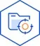
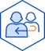
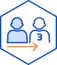

# 건강배급소 개인정보처리방침

새로엠에스㈜(이하 ‘회사')는 『정보통신망법 이용 촉진 및 정보보호 등에 관한 법률』 및 『개인정보보호법』에 따라 고객님의 개인정보를 보호하고 권리를 행사할 수 있는 방법을 다음과 같이 공개하고 있으며 개인정보 주체의 개인정보 보호와 관련한 법적 의무를 준수하고 있습니다.

**주요 개인정보 처리 표시(라벨링)**

|  |  |  |
|:---:|:---:|:---:|
| **개인정보 수집** | **개인정보 처리목적** | **개인정보 보유기간** |
|  |  |  |
| **개인정보 제3자 제공** | **개인정보 처리위탁** | **개인정보 열람 청구** |

### **목차**

「개인정보 처리방침」은 다음과 같은 내용으로 구성되어 있습니다.

- 개인정보 처리 목적, 수집 항목, 보유 및 이용기간
- 정보주체 이외로부터 수집한 개인정보의 수집 출처
- 만 14세 미만 아동의 개인정보 처리에 관한 사항
- 개인정보의 제3자 제공
- 개인정보 처리의 위탁
- 개인정보의 파기
- 정보주체와 법정대리인의 권리·의무 및 행사방법
- 개인정보의 안전성 확보조치
- 개인정보 자동 수집 장치의 설치·운영 및 거부에 관한 사항
- 개인정보보호책임자 및 개인정보 열람청구
- 권익침해 구제방법
- 광고성 정보 전송
- 개인정보 처리방침의 변경

---

## 1. 개인정보 처리 목적, 수집 항목, 보유 및 이용기간

### 1-1. 개인정보 수집 및 이용 동의

1. 회사는 다음과 같은 방법으로 동의 절차를 마련하여 개인정보를 수집 및 이용합니다. 아래 목적 이외로는 개인정보를 이용하지 않으며 목적이 변경되는 경우 별도의 동의를 받는 등 필요한 조치를 합니다.
2. 회원가입 및 서비스 이용과정에서 이용자가 동의를 하고 간편인증(카카오, 네이버)을 통해 개인정보를 수집합니다.
3. 개인 맞춤형 건강기능식품 추천 서비스를 제공하기 위하여 건강 설문조사 또는 건강검진 결과 연동을 통해 민감정보를 수집하며, 이는 이용자의 명시적 동의를 받아 수집합니다.
4. 수집 목적 외 이용하지 아니하며 수집된 정보는 기술적/관리적 보호조치를 통하여 암호화하여 저장하고 접근권한 및 통제를 제어하여 안전하게 관리하고 있습니다.

### 1-2. 수집 항목, 보유 및 이용기간(필수)

| 
  구분
   | 
  수집항목
   | 
  수집목적
   | 
  보유 및 이용기간
   |
| --- | --- | --- | --- |
| [필수] 회원 가입 및 관리 | 카카오/네이버계정(이름(닉네임), 이메일, 휴대폰 번호), 중복가입확인정보(DI)
   | SNS 간편 회원 가입 및 로그인 연동, 정보주체 식별·인증, 회원자격 유지·관리 | 회원 탈퇴 시까지 |
| [필수] 주문 및 결제, 배송 |   1. 카드결제 : 결제정보(카드사명, 결제금액, 결제일시, 결제승인번호, 주문이력)
2. 배송에 필요한 정보 : 구매자 정보(이름, 휴대폰번호), 배송지 정보(수령인명, 배송지명, 휴대폰번호, 주소) | 맞춤형 영양제 결제 및 제품 배송 | 회원 탈퇴 시까지 |
| [필수] 맞춤형 영양제 서비스 | **1. 고객이 직접 입력하는 정보 (직접 수집)**
건강 문진(설문) 응답 결과 (임신·출산 상태, 분만 예정일, 갱년기 증상, 질환 이력, 복용 약물, 식품 알레르기, 음주 및 흡연 여부, 심리 상태 등의 건강 정보 일체)
   
**2. 국민건강보험공단 건강검진 정보 (간접 수집)** 
건강검진 항목(BMI, 허리둘레, 체질량지수혈압, 공복혈당, 콜레스테롤(총콜레스테롤, HDL, LDL, 중성지방), 간기능수치(AST, ALT, 감마지피티), 신장기능수치(혈청크레아티닌, 신사구체여과율)) | 맞춤형 영양제 서비스 제공 | 회원 탈퇴 혹은 이용 동의 철회 시까지 |

### 1-3. 수집 항목, 보유 및 이용기간(선택)

| 
  구분
   | 
  수집항목
   | 
  수집목적
   | 
  보유 및 이용기간
   |
| --- | --- | --- | --- |
| 회원 가입 및 로그인 | 카카오/네이버계정(프로필 사진, 성별) | 회원 관리 및 서비스 제공
   | 회원 탈퇴 시까지
   |
| 건강검진정보 연동을 위한 간편인증
   | 이름, 휴대전화번호, 생년월일, 성별(주민등록번호 뒷1자리) | 건강보험공단 건강검진결과 연동을 위한 본인확인
   | 본인확인완료 후 
즉시 파기
   |

단, 관계법령의 규정에 의하여 개인정보를 보존할 필요가 있는 경우에는 해당 기간 동안 개인정보를 안전하게 보관 합니다.
① 계약 또는 청약철회 등에 관한 기록 : 5년 (전자상거래 등에서의 소비자보호에 관한 법률)

② 대금 결제 및 재화 등의 공급에 관한 기록 : 5년 (전자상거래 등에서의 소비자보호에 관한 법률)

③ 소비자의 불만 또는 분쟁처리에 관한 기록 : 3년 (전자상거래 등에서의 소비자보호에 관한 법률)

④ 서비스 이용 관련 기록 : 3개월 (통신비밀보호법)

⑤ 표시/광고에 관한 기록 : 6개월 (전자상거래 등에서의 소비자보호에 관한 법률)

⑥ 거래내역 관련 정보 : 5년 (국세기본법)

⑦ 고객 확인 의무를 위한 기록 : 5년 (특정 금융거래정보의 보고 및 이용 등에 관한 법률)

**서비스 이용과정에서 수집될 수 있는 정보**

- 서비스 이용 및 중지기록, 접속로그, 쿠키, 접속IP정보

---

## 2. **정보주체 이외로부터 수집한 개인정보의 수집 출처**

| 
  수집 출처
   | 
  수집 항목
   | 
  수집·이용 목적
   | 
  보유·이용 기간
   |
| --- | --- | --- | --- |
| 국민건강보험공단 | **건강검진정보
(*민감정보 – 간접 수집)**
BMI, 허리둘레, 체질량지수혈압, 공복혈당, 콜레스테롤(총콜레스테롤, HDL, LDL, 중성지방), 간기능수치(AST, ALT, 감마지피티), 신장기능수치(혈청크레아티닌, 신사구체여과율) | **건강검진 결과 정보 조회 및 연동 (*민감정보)**
   | 서비스 이용 철회 혹은 회원탈퇴 시 |

회사는 법정대리인의 동의가 필요한 만 14세 미만 아동의 개인정보를 수집하지 않습니다.

---

## 3. **만 14세 미만 아동의 개인정보 처리에 관한 사항**

1. 회사는 법정대리인의 동의가 필요한 만 14세 미만 아동의 개인정보를 수집하지 않으며, 만 14세 미만 아동은 해당 서비스 이용이 불가능합니다. 

## **4. 개인정보의 제3자 제공**

### **4-1. 개인정보 제3자 제공**

1. 회사는 정보주체의 개인정보를 목적에서 명시한 범위 내에서만 처리하며, 정보주체의 동의, 법률의 특별한 규정 등 「개인정보보호법」 제17조 및 제18조에 해당하는 경우에만 개인정보를 제3자에게 제공하고 그 이외에는 정보주체의 개인정보를 제3자에게 제공하지 않습니다.

| 
  제공받는 자
   | 
  제공 목적
   | 
  제공 항목
   | 
  보유 및 이용 기간
   |
| --- | --- | --- | --- |
| ㈜카카오 | 국민건강보험공단 간편인증(카카오인증서)을 위한 인증 정보 전달 | 성명, 생년월일, 휴대폰번호, 성별(주민등록번호 뒷 1자리) | 인증 완료 및 목적 달성 시까지 |

## 5. **개인정보 처리의 위탁**

### **5-1. 개인정보 처리 위탁 현황**

1. 회사는 원활한 개인정보 업무 처리를 위하여 다음과 같이 개인정보처리업무를 위탁하고 있습니다.

| 수탁자 | 업무의 내용 | 보유 기간 |
| --- | --- | --- |
| AWS (Amazon Web Service Inc) | 개인정보가 저장된 국내 클라우드 서버 운영 및 관리 | 위탁 계약 만료 또는 개인정보 삭제 요청 시 파기 |
| ㈜카카오 | 간편 로그인 및 회원 가입 | 위탁 계약 만료 또는 개인정보 삭제 요청 시 파기 |
| 네이버㈜ | 간편 로그인 및 회원 가입 | 위탁 계약 만료 또는 개인정보 삭제 요청 시 파기 |
| ㈜에스더블유헬스케어 | 개인맞춤형 건강기능식품 소분, 포장 | 위탁 계약 만료 또는 개인정보 삭제 요청 시 파기 |
| 채널톡 | SMS, 채널톡 채팅을 활용한 고객 상담 서비스 운영 | 위탁 계약 만료 또는 개인정보 삭제 요청 시 파기 |
| NHN 클라우드 | SMS, 카카오톡 채널 등을 활용한 메시지 발송 | 위탁 계약 만료 또는 개인정보 삭제 요청 시 파기 |
| 한국정보통신(주) | 전자 결제 대행 서비스 | 위탁 계약 만료 또는 개인정보 삭제 요청 시 파기 |
| ㈜한진 | 상품 배송 | 배송 완료 후 즉시 파기 |
1. 회사는 고객이 미리 동의가 있거나 관련 법령의 규정에 의한 경우를 제외하고는 어떠한 경우에도 동의서에서 명시한 범위를 넘어 고객의 개인정보를 이용하거나 타인 또는 타 기업이나 기관에 제공하지 않습니다. 단, 고객의 문의 내용이나 불만 내용이 회사와의 관계라고 판단될 경우에는 신속한 서비스를 위해 해당 협력업체에 고객의 개인정보 및 접수 내용을 제공할 수 있습니다.
2. 위탁계약 시 개인정보보호의 안전을 기하기 위하여 개인정보보호 관련 지시 엄수 및 개인 정보에 관한 금지 및 사고 시의 책임부담 등을 명확히 규정하고 계약 내용을 서면 및 전자적으로 보관하고 있습니다. 동 업체가 변경될 경우, 회사는 변경된 업체명을 개인정보처리방침 화면에 공지합니다.

## 6. 개인정보의 파기

### 6-1. 개인정보 처리 위탁 현황

1. 회사는 개인정보 보유기간의 경과, 처리목적 달성 등 개인정보가 불필요하게 되었을 때에는 지체 없이 해당 개인정보를 파기합니다.
2. 정보주체로부터 동의 받은 개인정보 보유기간이 경과하거나 처리목적이 달성되었음에도 불구하고 다른 법령에 따라 개인정보를 계속 보존하여야 하는 경우에는, 해당 개인정보를 별도의 데이터베이스(DB)로 옮기거나 보관장소를 달리하여 보존합니다.

**① 파기절차**

- **개인정보의 파기** : 보유기간이 경과한 개인정보는 종료일로부터 지체 없이 파기합니다.
- **개인정보파일의 파기** : 개인정보파일의 처리 목적 달성, 해당 서비스의 폐지, 사업의 종료 등 그 개인정보파일이 불필요하게 되었을 때에는 개인정보의 처리가 불필요한 것으로 인정되는 날로부터 지체 없이 그 개인정보파일을 파기합니다.

**② 파기방법**

- 전자적 파일 형태로 기록·저장된 개인정보 기록을 재생할 수 없도록 디가우징 및 완전삭제 솔루션을 이용하여 파기하며, 종이 문서에 기록·저장된 개인정보는 세단기로 분쇄하거나 소각하여 파기합니다.

## 7. **정보주체와 법정대리인의 권리·의무 및 행사방법**

1. 정보주체는 회사에 대해 언제든지 개인정보 열람·정정·삭제·처리정지요구 등의 권리를 행사할 수 있습니다.
    
    **① 개인정보의 열람 및 정정 범위**
    
    - 회사가 가지고 있는 고객의 개인정보
    - 회사가 고객의 개인정보를 이용하거나 제3자에게 제공한 현황
    - 고객이 개인정보 수집·이용·제공 등의 동의를 한 현황
    
    **② 개인정보의 열람, 정정 및 동의 철회 방법**
    
    - 고객센터(새로엠에스 본사) 방문 후 본인 확인
    - 이메일 : gunbae@ildong.com
    - 서면: 서울특별시 서초구 바우뫼로27길 2 (새로엠에스 본사)
    - 전화: 고객센터(02-526-3533)
2. 권리 행사는 회사에 대해 「개인정보보호법」 시행령 제41조 제1항에따라 서면, 전자우편 등을 통하여 하실 수 있으며, 회사는 이에 대해 지체 없이 조치하겠습니다.
3. 권리 행사는 정보 주체의 법정대리인이나 위임을 받은 자 등 대리인을 통하여 하실 수도 있습니다. 이 경우 "개인정보 처리 방법에 관한 고시" 별지 제11호 서식에 따른 위임장을 제출하셔야 합니다.
4. 개인정보 열람 및 처리정지 요구는 「개인정보보호법」 제35조 제4항, 제37조 제2항에 의하여 정보 주체의 권리가 제한될 수 있습니다.
5. 개인정보의 정정 및 삭제 요구는 다른 법령에서 그 개인정보가 수집 대상으로 명시되어 있는 경우에는 그 삭제를 요구할 수 없습니다.
6. 회사는 정보 주체 권리에 따른 열람의 요구, 정정·삭제의 요구, 처리 정지의 요구 시 열람 등 요구를 한 자가 본인이거나 정당한 대리인인지를 확인합니다.

---

## 8. **개인정보의 안전성 확보조치**

회사는 개인정보의 안전성 확보를 위해 다음과 같은 조치를 취하고 있습니다.

1. **관리적 조치** : 개인정보보호 지침 수립·시행, 전담조직 운영, 정기적 직원 교육
2. **기술적 조치** : 개인정보처리시스템 등의 접근권한 관리, 접근통제시스템 설치, 개인정보의 암호화, 보안프로그램 설치 및 갱신
3. **물리적 조치** : 전산실, 자료보관실 등의 접근통제

## 9. **개인정보 자동 수집 장치의 설치·운영 및 거부에 관한 사항**

1. 회사는 정보주체의 이용정보를 저장하고 수시로 불러오는 '쿠키(cookie)'를 사용합니다.
2. 쿠키는 웹사이트를 운영하는데 이용되는 서버(http)가 이용자의 컴퓨터 브라우저에게 보내는 소량의 정보이며 이용자들의 PC 컴퓨터 내의 하드디스크에 저장되기도 합니다.

**① 쿠키의 사용 목적** : 이용자의 접속빈도나 방문시간 등을 파악하여 이용자에게 보다 편리한 서비스를 제공하기 위해 사용됩니다.

**② 쿠키의 설치·운영 및 거부** : 브라우저 옵션 설정을 통해 쿠키 허용, 쿠키 차단 등의 설정을 할 수 있습니다.

- Internet Explorer : 웹브라우저 우측 상단의 도구 메뉴 > 인터넷 옵션 > 개인정보 > 설정 > 고급
- Edge : 웹브라우저 우측 상단의 설정 메뉴 > 쿠키 및 사이트 권한 > 쿠키 및 사이트 데이터 관리 및 삭제
- Chrome : 웹브라우저 우측 상단의 설정 메뉴 > 개인정보 및 보안 > 쿠키 및 기타 사이트 데이터

**③** 쿠키 저장을 거부 또는 차단할 경우 서비스 이용에 어려움이 발생할 수 있습니다.

## **10. 개인정보보호책임자 및 개인정보 열람청구**

회사는 개인정보 처리에 관한 업무를 총괄해서 책임지고, 개인정보처리와 관련한 정보주체의 불만처리 및 피해구제 등을 위하여 아래와 같이 개인정보 보호책임자를 지정하고 있습니다.

| **구분** | **소속** | **이름** | **연락처** |
| --- | --- | --- | --- |
| 개인정보 보호책임자 | ICT개발실 | 박우석 | wsp@saeroms.com |
| 개인정보 보호담당자 | e-Platform사업부 | 하정윤 | gunbae@ildong.com / 02-526-3629 |

정보주체는 회사의 서비스를 이용하시면서 발생한 모든 개인정보보호 관련 문의, 불만처리, 피해구제 등에 관한 사항을 개인정보 보호책임자 및 담당부서로 문의할 수 있습니다. 회사는 정보주체의 문의에 대해 지체 없이 답변 및 처리해드릴 것입니다.

## **11. 권익침해 구제방법**

### **11-1. 회사 내부 구제절차**

| **개인정보보호부서** | **개인정보보호담당자** | **연락처** | **전자우편** |
| --- | --- | --- | --- |
| e-Platform사업부 | 하정윤 | 02-526-3629 | gunbae@ildong.com |

정보주체는 개인정보침해로 인한 구제를 받기 위하여 개인정보분쟁조정위원회, 한국인터넷진흥원 개인정보침해신고센터 등에 분쟁해결이나 상담 등을 신청할 수 있습니다.

1. 개인정보분쟁조정위원회 : (국번없이) 1833-6972 (www.kopico.go.kr)
2. 개인정보침해신고센터 : (국번없이) 118 (privacy.kisa.or.kr)
3. 대검찰청 : (국번없이) 1301 (www.spo.go.kr)
4. 경찰청 : (국번없이) 182 (ecrm.cyber.go.kr)

「개인정보보호법」 제35조(개인정보의 열람), 제36조(개인정보의 정정·삭제), 제37조(개인정보의 처리정지 등)의 규정에 의한 요구에 대하여 공공기관의 장이 행한 처분 또는 부작위로 인하여 권리 또는 이익의 침해를 받은 자는 행정심판법이 정하는 바에 따라 행정심판을 청구할 수 있습니다.

- 중앙행정심판위원회 : (국번없이) 110 (www.simpan.go.kr)

## **12. 광고성 정보 전송**

### **12-1. 광고성 정보 전송 원칙**

회사는 회원의 사전 동의를 받지 않으면 영리목적의 광고성 정보를 전송하지 않습니다.

### **12-2. 광고성 정보 전송 방법**

회사는 상품정보 안내 등 온라인 마케팅을 위해 광고성 정보를 전자우편, SMS 등으로 전송하는 경우 다음과 같이 회원께서 쉽게 알아볼 수 있도록 조치합니다.

**① 전자우편의 제목란**

- (광고)라는 문구를 제목란에 표시하며, 전자우편 본문란의 주요 내용을 표시합니다.

**② 전자우편의 본문란**

- 이용자가 수신거부의 의사표시를 할 수 있는 전송자의 명칭, 전자우편 주소, 전화번호 및 주소를 명시합니다.
- 이용자가 수신거부의 의사를 쉽게 표시할 수 있는 방법을 한글 및 영문으로 각각 명시합니다.

### **12-3. 수신 거부**

회원은 언제든지 다음의 방법으로 광고성 정보 수신을 거부할 수 있습니다.

1. 건강배급소 웹사이트 > 마이페이지 > 회원정보 수정 > 마케팅 수신 동의 설정 변경
2. 수신한 광고성 정보 내 수신거부 링크 클릭
3. 고객센터(02-526-3533) 또는 이메일(gunbae@ildong.com)을 통한 수신거부 요청

## **13. 개인정보 처리방침의 변경**

본 개인정보처리방침은 시행일로부터 적용되며, 법령 및 방침에 따른 변경 내용의 추가, 삭제 및 정정이 있는 경우에는 변경사항의 시행 7일 전부터 공지사항을 통하여 고지할 것입니다. 단, 개인정보의 수집 및 활용, 제3자 제공 등과 같이 이용자의 권리에 중요한 변경의 사유가 발생하는 경우 최소 14일 전에 공지합니다.

1. 이 개인정보 처리방침 개정 및 시행일자 : **2026년 03월 23일**
2. 이전의 개인정보처리방침은 '이전 개인정보 처리방침 보기'에서 확인하실 수 있습니다.
